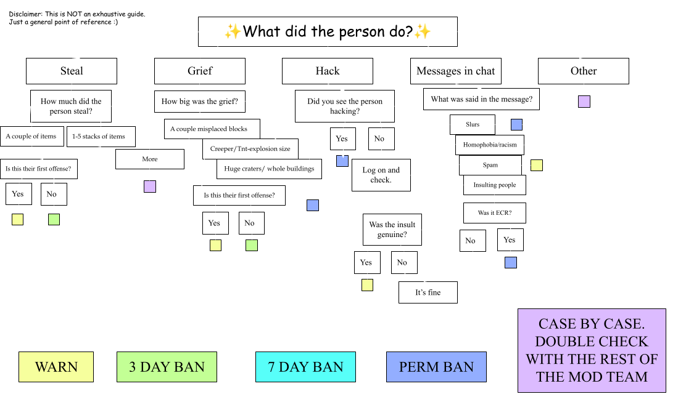

# BanManager (Punishments Plugin)

> Plugin for bannning, muting, kicking, ipbanning, warning, and any other punishment!
## Quick refrence guide:

## Commands:
| Command Name        | Description           | Aliases  |
| ------------- |:-------------:| -----:|
| `/tempban`      | `Temporarily bans a specified user for a variable ammount of time` [More info](#Tempban) | `/bm tempban` |
| `/ip ban`      | `Bans all accounts tied to a specified user's IP adress` [More info](#Lookup) | `/bm ban` |
| `/warn`      | `Warns a specified user` [More info](#Rollback) | `/bm warn` |
| `/unban`      | `Unbans a specified user` [More info](#Restore) | `/bm unban` |

###Tempban
